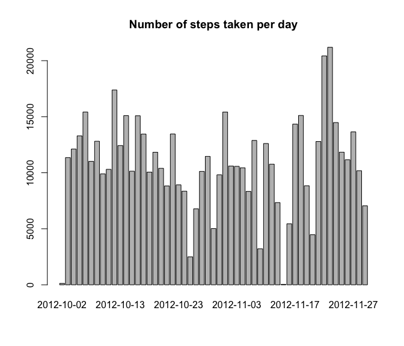
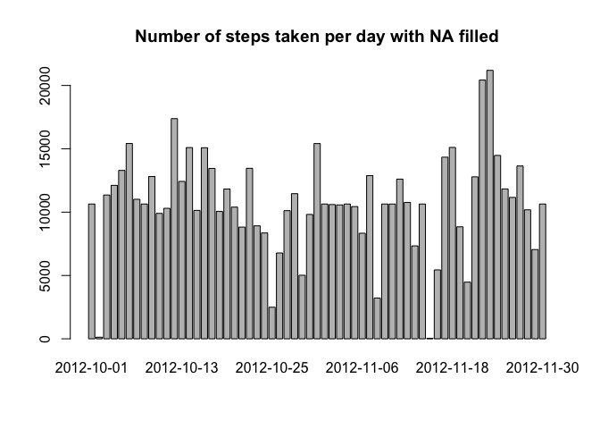

# Reproducible Research: Peer Assessment 1

In this document I am going to make the Peer Assessment of the Course of Coursera Reproducible Research.


## Loading and preprocessing the data

```r
knitr::opts_chunk$set(tidy=FALSE, fig.path='figures/')

file <- unzip("activity.zip")
data <- read.csv(file)

head(data)
```

```
##   steps       date interval
## 1    NA 2012-10-01        0
## 2    NA 2012-10-01        5
## 3    NA 2012-10-01       10
## 4    NA 2012-10-01       15
## 5    NA 2012-10-01       20
## 6    NA 2012-10-01       25
```


## What is mean total number of steps taken per day?

```r
stepsbydate <- aggregate(steps ~ date, data = data, FUN=sum)
barplot(stepsbydate$steps, main ="Number of steps taken per day", names.arg=stepsbydate$date)
```

 

Now we are going to calculate the mean and the median of steps per day

```r
meanSteps <- round(mean(stepsbydate$steps),2)
medianSteps <- round(quantile(stepsbydate$steps, probs = 0.5),2)
```
The mean steps per day is 10766 and the median steps is 10765

## What is the average daily activity pattern?

```r
stepsbyinterval <- aggregate(steps ~ interval, data = data, FUN=mean)
plot(x=stepsbyinterval$interval, stepsbyinterval$steps, main ="Daily activity pattern", type="l")
```

 


```r
si <- stepsbyinterval[order(stepsbyinterval$steps, decreasing = TRUE),]
maximum <- si[1,1]
maxvalue <- si[1,2]
```
The interval labeled as 835 is where there are the maximum number of steps average a day(206.1698).


## Imputing missing values

```r
#Number of cases with NA.
incompletes <- sum(!complete.cases(data))
```

The number of missing values in the dataset is 2304 so we are going to replace de NA values for the mean of that interval.


```r
#Round the mean of the steps
stepsbyinterval$steps <- floor(stepsbyinterval$steps)
datacomplete <- merge(data, stepsbyinterval, by="interval", suffixes=c("",".y"))
datacomplete$steps[is.na(datacomplete$steps)] <- datacomplete$steps.y[is.na(datacomplete$steps)]
datacomplete <- datacomplete[,c(1:3)]
stepscompletebydate <- aggregate(steps ~ date, data = datacomplete, FUN=sum)
barplot(stepscompletebydate$steps, main ="Number of steps taken per day with NA filled", names.arg=stepscompletebydate$date)
```

 


```r
meanStepsCom <- round(mean(stepscompletebydate$steps),2)
medianStepsCom <- round(quantile(stepscompletebydate$steps, probs = 0.5),2)
```
The mean steps per day is 10750 and the median steps is 10641. Which is not more differente between mean (10766) and median(10765) without replacing NA.


## Are there differences in activity patterns between weekdays and weekends?


```r
day <- function(date){
  if(weekdays(as.Date(date)) %in% c("sábado","domingo")){
    "weekend"
  }else{
    "weekday"
  }
}
datacomplete$day <- as.factor(sapply(datacomplete$date, day))
```

Watching the difference between both plots, we see that there are diference between weekdays and weekends. In weekends there are more steps at every interval in the day. But in weekdays there are a big ammount of steps at 830 interval (before starting jobs).


```r
par(mfrow = c(2, 1))
for (type in c("weekend", "weekday")) {
    steps.type <- aggregate(steps ~ interval, data = datacomplete, subset = datacomplete$day == type, FUN = mean)
    plot(steps.type, type = "l", main = type)
}
```

 


